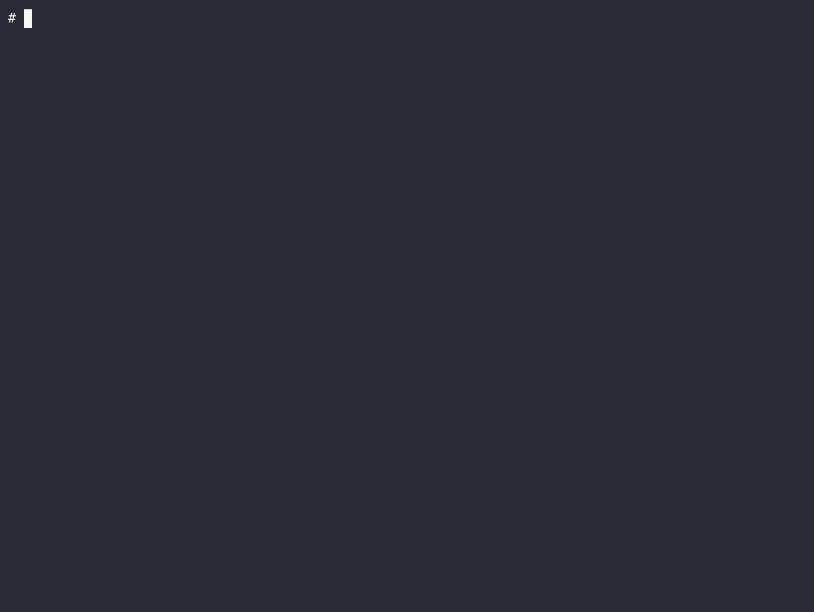

# screenshat

Take screenshots and videos of a website at different widths

I wanted to be able to review how a page worked across a full span of sizes--not just at a few fixed sizes.  I was already creating screenshots with Playwright.  I tried making videos directly with Playwright, but they weren't quite how I wanted them.  `screenshat` was born.

This project works fine for me, but it currently makes absolutely no guarantees about "stability". Defaults and command-line options are definitely subject to change as we play around with what's best.

# Demo



# Usage

```
Usage: screenshat [options] --url <url>

Take screenshots and videos of a website at different widths

Requires ffmpeg to be installed and in your PATH.

Options:
  --url <url>            URL to screenshot
  --min-width <pixels>   minimum width (default: 320)
  --max-width <pixels>   maximum width (default: 1920)
  --max-height <pixels>  maximum height in pixels, or "full" (default: 800)
  --output-dir <dir>     output directory (default: new temp directory)
  --browser <browser>    Playwright browser, like chromium, firefox, or webkit (default: "chromium")
  --no-progress          disable progress bars
  --json                 print details as JSON (it can be helpful to include --quiet)
  --output-mp4           output mp4 video
  --output-webm          output webm video
  --output-gif           output animated gif
  --output-png           output animated png
  --framerate <fps>      set frames per second for output video
  -q, --quiet            produce minimal command-line output
  -v, --verbose          produce more command-line output
  -V, --version          output the version number
  -h, --help             display help for command
```

# Installation

`screenshat` expects `ffmpeg` to be installed and in your PATH.  You can likely install ffmpeg the same way you install anything else on your computer.

If you have nodejs installed, you can run `screenshat` using `npx`:

```
npx screenshat --url https://google.com --min-width 320 --max-width 640 --output-gif
```

You can also install `screenshat` globally:

```
npm install -g screenshat
```

# Development

## Getting Started

This project is written in Javascript, and uses Node.js.  If you need guidance installing Node.js, try https://nodejs.dev/en/learn/how-to-install-nodejs/.

Next, you'll want to check out this repository, downloading it to your computer. After checking out this repository, run `npm install` to install dependencies. You can make your changes, and then run `npm run lint` to check for style issues.

If you run `npm link`, you should be able to run `screenshat` as if it were installed, letting you check your changes interactively.

This project, unfortunately, does not have any automated tests yet! If you'd like to add some, please do! Once there are tests, if you can, please write tests for your changes.

## Contributing

See CONTRIBUTING.md.
